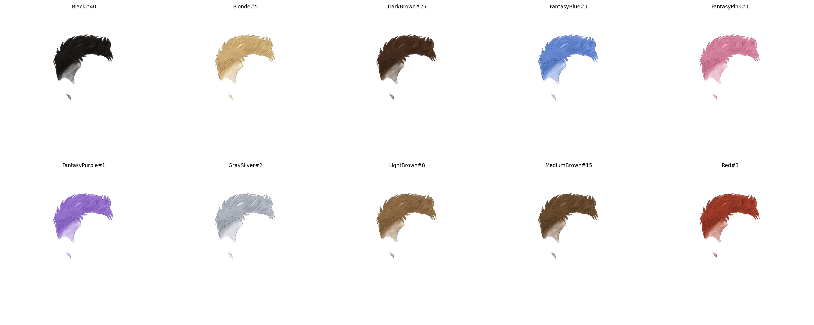

# NFT Hair Colorizer

A lightweight Python pipeline for batch-recoloring grayscale hairstyle sprites
across multiple color palettes — built for NFT trait generation workflows.

## Features

- Brightness-preserving colorization (shadow → base → highlight blending)
- Accessory masking — protect beads, clips, or dyed tips from recoloring
- Rarity weight encoding directly in output filenames (`#{weight}`)
- Compatible with HashLips, Bueno, and any `#weight` filename-based combiner
- No OpenCV dependency — only Pillow + NumPy


---

## Option 1 — Run Locally

### Requirements

- Python 3.8 or higher
- pip

### Steps

- ## ⚡ Quick Start
1. Draw hairstyles in grayscale in ibis Paint, export as PNG
2. Drop PNGs into a `Hairstyles/` folder
3. Edit the `COLORABLE` list in the script with your filenames
4. Run: `pip install Pillow numpy && python generate_hair_colors_example.py`
5. Pick up your colored variants from `Hairstyles_Colored/`

**1. Download the script**

Either clone the repo or just download `generate_hair_colors_example.py` directly from this page put into an agent or claude to personalize based on your traits (click the file → click the download icon).


**2. Install dependencies** 

```bash
pip install Pillow numpy
```

**3. Set up your folder**

Create a folder called `Hairstyles` in the same directory as the script and drop your grayscale PNG sprites inside it:

```
your-folder/
├── generate_hair_colors_example.py
└── Hairstyles/
    ├── your_style_a.png
    ├── your_style_b.png
    └── ...
```

**4. Configure the script**

Open `generate_hair_colors_example.py` in any text editor and update the top section or use the prompt in `HAIR_COLORIZER_PROMPT.MD` to edit with reference to the generate_hair_colors...:

| Variable | What to change |
|---|---|
| `COLORABLE` | List your sprite base names (no `.png`) |
| `NO_COLOR` | List any bald/pass-through sprites |
| `HAIR_PALETTES` | Define your color palettes |
| `WEIGHTS` | Set rarity weights per color |
| `ACCESSORY_RULES` | Add hue rules for any colored accessories |

**5. Run**

```bash
python generate_hair_colors_example.py
```

Output is saved to `Hairstyles_Colored/` automatically.

---

## Option 2 — Run on Google Colab

No local Python install needed. Everything runs in your browser.

**1. Open a new Colab notebook**

Go to [colab.research.google.com](https://colab.research.google.com) → **New notebook**

**2. Install dependencies**

In the first cell:

```python
!pip install Pillow numpy
```

**3. Upload your sprites**

In the second cell, run this to upload your PNG files:

```python
from google.colab import files
import os

os.makedirs("Hairstyles", exist_ok=True)
uploaded = files.upload()  # opens a file picker — select all your PNGs

for filename, data in uploaded.items():
    with open(f"Hairstyles/{filename}", "wb") as f:
        f.write(data)

print("Uploaded:", list(uploaded.keys()))
```

**4. Paste and configure the script**

In the next cell, paste the full contents of `generate_hair_colors.py`.
Edit the `COLORABLE`, `NO_COLOR`, `HAIR_PALETTES`, and `WEIGHTS` sections at
the top to match your sprites, then run the cell. Or better still use the version generated by Claude or Chatgpt

**5. Download the output**

After the script finishes, run this in a new cell to zip and download everything:

```python
import shutil
shutil.make_archive("Hairstyles_Colored", "zip", "Hairstyles_Colored")

from google.colab import files
files.download("Hairstyles_Colored.zip")
```

Your browser will download a zip of all colored sprites.

---

## Output Format

```
{sprite_name}_{ColorName}#{weight}.png
```

Example: `short_textured_Black#40.png`, `waves_Blonde#5.png`


---

## Sprite Requirements

| Property   | Requirement                         |
|------------|-------------------------------------|
| Format     | PNG with alpha channel (RGBA)       |
| Base style | Grayscale or near-grayscale         |
| Background | Transparent (alpha = 0)             |

---
## Made with this tool : Ibix Paint, claude, chatgpt and Colab

## Docs

See [`HAIR_COLORIZER_PROMPT.md`](HAIR_COLORIZER_PROMPT.md) for the full prompt,
palette design guide, accessory mask setup, and customization checklist.

---

## License

MIT — see `LICENSE`
